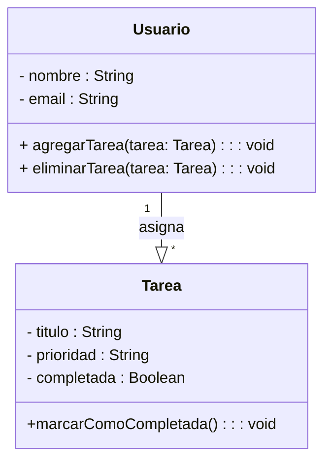

# TaskMaster - Aplicación de Gestion de Tareas

## Descripción

TaskMaster es una aplicacion diseñada para mejorar la productividad, permitiendo gestionar tareas de
manera eficiente. Con esta herramienta, los usuarios pueden organizar sus actividades diarias de
manera sencilla y eficaz

## Características

- Creación y edicion de tareas
- Asignacion de fechas limite y prioridades
  - Prioridad baja, media y alta
  - Fechas limite de personalizacion con control de calendario
- Organización en categorias y etiquetas
- Marcar tareas como completadas
- Notificaciones y recordatorios automaticos
- Visualización en lista y tablero kanban

## Instalación

Para instalar y ejecutar la aplicacion, sigue los siguientes pasos:

```bash
# Clonar el repositorio
git clone htpps://github.com/usuario/taskmaster.git
cd taskmaster

# Instalar dependencias
npm install

# Ejecutar la aplicacion
npm install
```

## Uso de la API

TaskMaster proporciona una API REST para gestionar tareas. A continuación, un ejemplo de cómo crear una tarea usando JavaScript

```JavaScript
fetch("https://api.taskmaster.com/tareas", {
    method: "POST",
    headers: { "Content-type": "application/json" },
    body: JSON.stringify({ titulo: "Nueva Tarea", prioridade: "Alta"})
})
.then(response => response.json())
.then(data => console.log("Tarea creada:", data));
```

## Fórmula de Productividad

La eficiencia del usuario se calcula con la siguiente formula:

$$E=\frac{Tareas Completadas}{Tareas Totales} * 100$$

Donde:

- *E* es la eficiencia en porcentaje.
- Tareas Completadas es el número de tareas finalizadas.
- Tareas Totales es el número total de tareas asignadas.

## Diagrama de Clases



## Capturas de Pantalla

A continuacion, una vista previa de la interfaz de usuario:

!

Para registrar una nueva tarea, sigue estos pasos:

1. Haz click en el botón **Nueva Tarea**.
2. Completa el formulario con los datos de la tarea.
   1. **Titulo**: Nombre de la tarea
   2. **Prioridad**: Nivel de importancia (baja,media,alta).
   3. **Fecha Límite**: Día y hora de vencimiento.
3. Haz click en **Guardar** para crear la tarea.
4. ¡Listo! La tarea se ha registrado correctamente.

## Historial de versiones

En la siguiente tabla se muestran las versiones publicadas de la aplicación:

|  Version |     Fecha     |          Descripción          |
| ---------:| :------------: | :------------------------ |
|1.0.0       |01/01/2024|Lanzamiento inicial          |
|1.1.0        |15/01/2024|Nuevas funcionalidades  |
|1.1.1         |30/01/2024|Corrección de errores   |
|1.2.0        |15/02/2024|Mejoras de rendimiento|
|2.0.0        |15/03/2024|Versión estable             |
|2.1.0         |30/03/2024|Correción de errores   |
|2.2.0         |15/04/2024|Mejoras de usabilidad  |
|2.3.0         |30/04/2024|Nuevas funcionalidades|

## Créditos

Desarrollado por **Ricardo Ándres Bautista Díaz**

[Perfil de GitHub](https://github.com/RBD-20002)

## Licencia

Este proyecto está bajo la Licencia MIT.