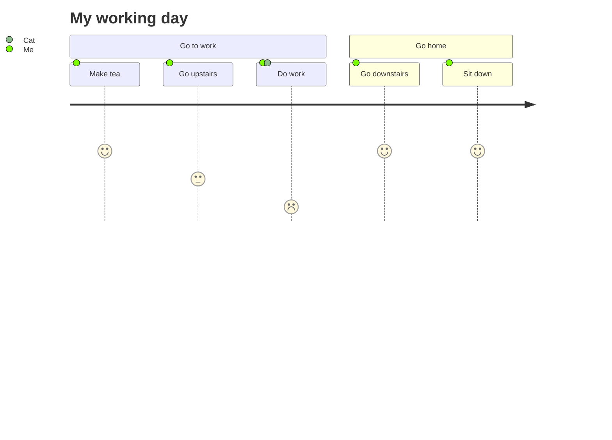

/*Titulos*/

# Hola

## Esto es una prueba

### Esto es un subtitulo 1

#### Esto es un subtitulo 2

/*Tipos de escritura*/

**Esto es negrita**

*Esto es cursiva*

***Esto es negrita y cursiva***

/*Listados*/

/*sin ordenar*/

- Lista nivel 1
  - Lista nivel 2
    - Lista nivel 3

/*ordenado*/

1. Lista nivel 1
   1. Lista sub nivel 2
      1. Lista subsub nivel 3


/*Lista de tareas*/

- [x] tarea 1
- [x] Tarea 2


/*Citas*/

> Esto es un cita 1
>> Esto es un sub cita 2
>>>Esto es un sub cita 3

/*Trozos de codigo*/

`print("Hola, mundo")`

```python
print("Hola, mundo")

def Hola()
    print("Hola, mundo")
```

```Java
System.out.println("Hola, mundo");
```

```HTML
<html>
  <head>
    <meta charset="utf-8" />
    <title>Mi pagina de prueba</title>
  </head>
  <body>
    
  </body>
</html>
```

```plaintext
Esto es texto plano
```

/*Enlaces*/

- foto
  

- enlace al mismo markdown
[Enlace a una pagina web](https://markdown.es/)

/*Escapado de caracteres*/

Texto con \*dos asteriscos


/*Tablas*/

|      Python    |    Java       |
| ------------- | ------------ |
| celda 1        | celda 2       |
| Fin de celda                     | 


/*HTML*/

<html>
  <head>
    <meta charset="utf-8" />
    <title>Mi pagina de prueba</title>
  </head>
  <body>
    
  </body>
</html>


/*Diagramas*/




/*Ecuaciones*/

$E=mc^2$ 

$$F = G \frac{m_1 m_2}{r^2}$$